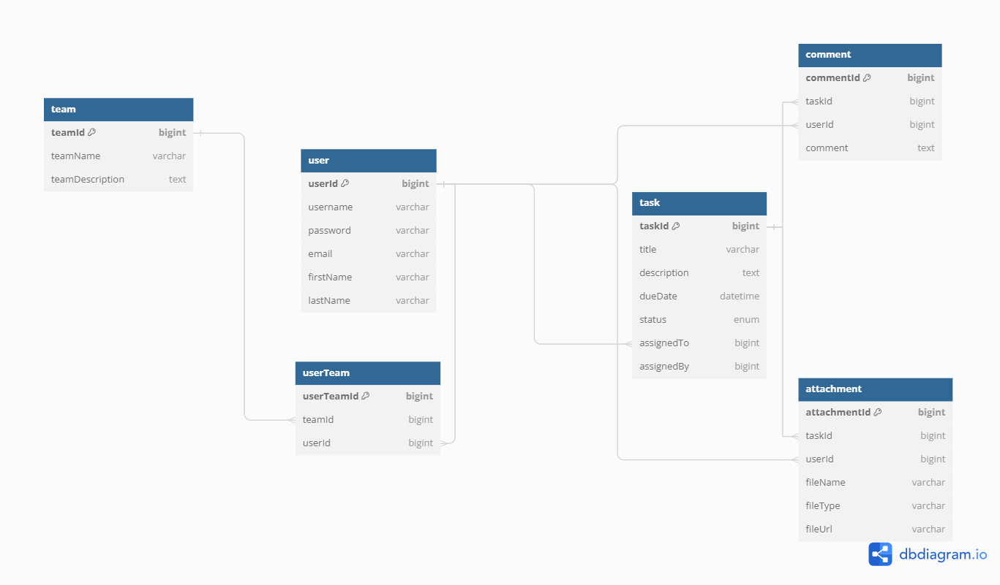

# Task Master : collaborative-task-manager
Developed a backend system for a task tracking and management application that facilitates collaboration and organization within teams or projects. The application will allow users to create, assign, and track tasks, as well as collaborate with team members through comments and attachments.

1. Requirement
[User Stories](./User_stories.txt)

2. ER Diagram
[ER Diagram](./TaskMaster.png)

