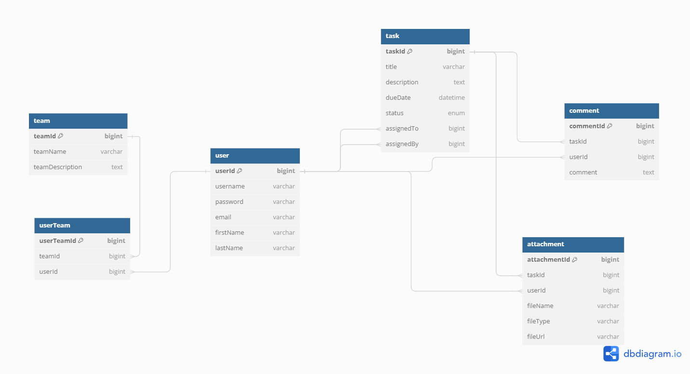

# Task Master : collaborative-task-manager
Developed a backend system for a task tracking and management application that facilitates collaboration and organization within teams or projects. The application will allow users to create, assign, and track tasks, as well as collaborate with team members through comments and attachments.

## Requirement

[User Stories](./User_stories.txt)

## ER Diagram 

[ER Diagram](./Taskmaster_Application_ER_Diagram.png)

## API endpoints

This project provides the following API's:

|           Endpoint   | Description                                                                            |
| ---------------------------------: | :----------------------------------------------------------------------  |
| `POST /register`                   | Register a new user.                                                     |
| `POST /login`                      | Log in a user.                                                           |
| `POST /logout`                     | Log out a user.                                                          |
| `GET /profile`                     | View Profile for the logged-in user.                                     |
| `PUT /profile`                     | Update Profile for the logged-in user.                                   |
| `POST /teams`                      | Create and add members to the team.                                      |
| `POST /tasks`                      | Create New Task.                                                         |
| `PUT /tasks/:taskId`               | Mark a task as completed when the logged-in user finished working on it. |
| `GET /tasks`                       | View a list of all tasks assigned to the logged-in user.                 |
| `GET /tasks/status`                | Filter tasks of the logged-in user based on status.                      |
| `GET /tasks/search`                | Search tasks of the logged-in user by title or description.              |
| `PUT /tasks/:taskId/assign`        | Assign any task to another user.                                         |
| `POST /tasks/:taskId/collaborate`  | Add comments and attachments to a task.                                  |

## Installation

To run this project locally, please follow these steps to get started:

Clone this repository: git clone https://github.com/Shikha-Shetty/collaborative-task-manager.git

Navigate to the project directory: `cd project-directory`

Install dependencies: `npm install`

## Usage
To start the API server, run the following command: `npm run start`

## Postman Collection

   [View Postman Collection Documentation](https://documenter.getpostman.com/view/6720526/2sA3JRYe1E)

   [JSON file to import into Postman](Collaborative_Task_Manager.postman_collection.json)

## MySQL Database Tables screenshots

[MySQL DATABASE TABLES.docx](MySQL_DATABASE_TABLES.docx)
